# Plan My Run

[Plan My Run](https://sean-meade.github.io/plan-my-run/) is a website which allows runners to plan a run. It gives them the ability to choose a starting location, time, day, and then to map out their route with mouse clicks or finger taps. The running will receive weather information for the time and day, and a distance update on each click of the route they are planning.  

The longer the run the more difficult it gets. You have to make sure you plan your route so you run long enough distances to continue to progress. You can run the same shorter distance multiple times to make it up but speaking from experience this will drive you crazy. It is important to know how far you must run before going out and to make those runs as diverse as possible.

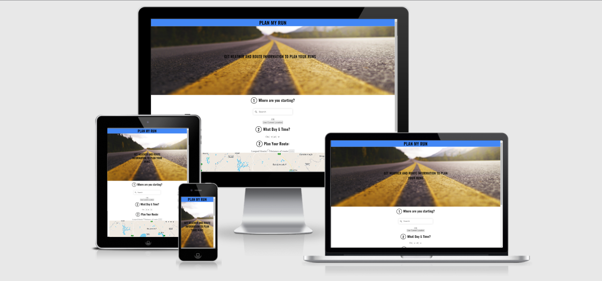

---

## Contents

- [Plan My Run](#plan-my-run)
  - [Contents](#contents)
  - [UX](#ux)
    - [Project Goals](#project-goals)
    - [Site Owner Goals](#site-owner-goals)
    - [Site Visitor/User Goals](#site-visitoruser-goals)
    - [User Stories](#user-stories)
    - [User Requirements and Expectations](#user-requirements-and-expectations)
      - [**Requirements**](#requirements)
      - [**Expectations**](#expectations)
    - [Design Choices](#design-choices)
      - [**Fonts**](#fonts)
      - [**Colours**](#colours)
  - [Wireframes](#wireframes)
    - [**Site Layout**](#site-layout)
  - [Information Architecture](#information-architecture)
  - [Technologies](#technologies)
    - [Languages](#languages)
    - [Libraries & Frameworks](#libraries--frameworks)
    - [APIs](#apis)
    - [Tools](#tools)
  - [Features](#features)
    - [Implemented Features](#implemented-features)
    - [Functional Features](#functional-features)
    - [Alert Features](#alert-features)
  - [Changes applied since planning](#changes-applied-since-planning)
  - [Testing](#testing)
    - [User Stories Testing](#user-stories-testing)
    - [Manual Testing](#manual-testing)
    - [Code Validation](#code-validation)
    - [Lighthouse Reports](#lighthouse-reports)
    - [Common Elements Testing](#common-elements-testing)
    - [Future Features](#future-features)
  - [Bugs](#bugs)
    - [Fixed Bugs](#fixed-bugs)
    - [Unfixed Bugs](#unfixed-bugs)
  - [Deployment](#deployment)
    - [Local Deployment](#local-deployment)
    - [Deployment to Github](#deployment-to-)
  - [Credits](#credits)
    - [Images](#images)
    - [Image editing](#image-editing)
    - [Code ideas](#code-ideas)
  - [Acknowledgements](#acknowledgements)

---

## UX

### Project Goals

The main goal of this project is to provide an app that helps runners plan their run. I am achieving this by providing a way for runners to map out potential routes which provides a feedback on distance. Also by adding the ability to get weather information for location, day and time.

### Site Owner Goals

- Provide the users with a helpful web application.
- Take the hassle out of finding a running route with the right distance.
- Provide weather information to inform gear choice.

### Site Visitor/User Goals

- Ability to choose what location to start the run in.
- Ability to choose the day and time for a run and with the location receive weather information.
- Ability to use the mouse to map out a running route and receive the distance of the route in return.

### User Stories

**Applies to all site users:**

- As a user, I am able to quickly understand how to navigate the site.
- As a user, I am able to choose what location to start the run in.
- As a user, I am able to change the location when I want.
- As a user, I am able to choose the day and time for a run and with location receive weather information
- As a user, I am able to change the day and time and update the weather information.
- As a user, I am able to use the mouse to map out a running route and receive the distance of the route in return.
- As a user, I am able to undo points of my route and the distance and map updates accordingly.
- As a user, I am able to make my run a looped run (returns back to where I started) and the distance and map updates accordingly.
- As a user, I am able to reset the map at any point and start fresh.
- As a user, I am able to find information or a link to the creator of the site.


**Applies to new site users:**

- As a user, I am able to understand how to use it without instruction.

**Applies to all returning users:**

- As a user, I am able to understand any changes that are made and use the site with no hinderance.

[Back to content](#contents)

### User Requirements and Expectations

#### **Requirements**

- Visually pleasant app design
- Easy site navigation
- Information of the content layed out in a simple and clear way on both mobile and larger screens
- Self-explanatory icons where text is absent

#### **Expectations**

- Quick app load time
- Easy to use "out of the box" with minimal explanation.


[Back to content](#contents)

### Design Choices

#### **Fonts**

- *All fonts*

  ```font-family: "Playfair Display", serif;```

#### **Colours**


[Back to content](#contents)

## Wireframes

### **Site Layout**

Site moc-ups were designed using [figma](figma). The focus was on defining the basic layout structure of the app and identifying how the display would change on different screen sizes such as mobile, tablet and larger screens.

You can view the wireframes created for this project in [site wireframes](/docs) folder here is a list:

- Mobile Wireframe: [Version 1](/docs/wireframes/Plan_My_Run_(Mobile).pdf)
- Laptop Wireframe: [Version 1](/docs/wireframes/Plan_My_Run_(Desktop_Laptop).pdf)

  **Please note, as I was developing the project, I have identified some weaknesses in the UX and therefore made the required changes. The deployed site looks somewhat different in comparison to the wireframes. These changes will allow the user to have a better experience and allow easier navigation. The design theme of the features is a close match to the overall site to ensure continuation and flow. Please check the [Changes applied since planning(#changes-applied-since-planning) section for explanation.*

[Back to content](#contents)

---

## Information Architecture

This is a one page application and as such the information architecture follows most important to least important information according to the intended user. The information is displayed in this order:

1. The title text: this text explains simply what the site does and how it can help the user. This is the most important because it's important for a visitor to understand the purpose of the site on first visit.

2. How to choose the starting point: The user has the choice of choosing the general location and then clicking the start point on the map or using there current location. This is second most important as it is the beginning point for finding a running route.

3. The map: The map along with the text following it is the next most important because it gives the user the information to start building their route with clicks on a map.

4. Functional buttons for the map: After clicking on the map the functional buttons allow more control over building a route. They can loop their route automatically as a lot of runners start and finish their route at the same point (but not all). The undo button allows the user to remove a click and keep the rest of their route intact. The reset route button allows the user to clear everything from the map and start again.

5. The map output: Once the route is made and the user is happy with it they can view the distance of that route and how many waypoints they have left to add to they route if need be.

6. Weather input: The weather is a nice to have when planning a run and so comes close to the end. The user can input the day and time of their run (limited to four days).

7. Weather output: Once the day and time of a run is chosen the user can click Get Weather Info button and receive the relevant weather information in return.

8. Creator information: Lastly if the user is curious as to who created it there is a link to his GitHub account at the bottom of the page in the footer.


[Back to content](#contents)

---  

## Technologies

### Languages

- [HTML](https://developer.mozilla.org/en-US/docs/Web/HTML)
- [CSS](https://developer.mozilla.org/en-US/docs/Web/CSS)
- [JavaScript](https://developer.mozilla.org/en-US/docs/Web/JavaScript)

### Libraries & Frameworks

- [jQuery](https://jquery.com/)
- [Google fonts](https://fonts.google.com/)
- [Font-Awesome](https://fontawesome.com/icons?d=gallery)
- [Turf](https://unpkg.com/browse/@turf/turf@6.3.0/)
- [Bootstrap](https://getbootstrap.com/)

### APIs

- [Weather API](https://www.weatherapi.com/)
- [Mapbox API](https://docs.mapbox.com/api/overview/)

### Tools

- [Git](https://git-scm.com/)
- [GitHub](https://github.com/)
- [Visual Studio Code](https://code.visualstudio.com/)
- [Color editor](https://coolors.co/)
- [Favicons](https://fontawesome.com/)
- [Pixabay](https://pixabay.com/)
- [LunaPic](https://www4.lunapic.com/editor/)
- [Iconfinder](https://www.iconfinder.com/icons/316043/raindrop_icon)

[Back to content](#contents)

---

## Features

### Implemented Features

- The site has **responsive design** when viewed on a mobile, tablet, and desktop.
- **Easy navigation** to external sites, such as social media accounts.
- The user is given feedback when they interact with the website (i.e. login to the website, add new gift, commit to buying a gift etc).

### Functional Features

#### __Loading Screen__
The loading screen allows time for the map to load properly before the user clicks on it. 


#### __Search Location Field__
The search location field allows the user to move the map to the general location of their run.

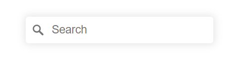

#### __Start Where I am Button__
This button allows the user to set their current location as the starting point of their route.


#### __Map__
The map allows the user to pan, zoom and angle the current area. By clicking on the route they can set the starting location (if not already set with Start where I am button) seen on the map as a white circle with a blue border. Each subsequent click is marked as a waypoint with a black dot and the route between these points (including the starting point) can be seen by the blue line.

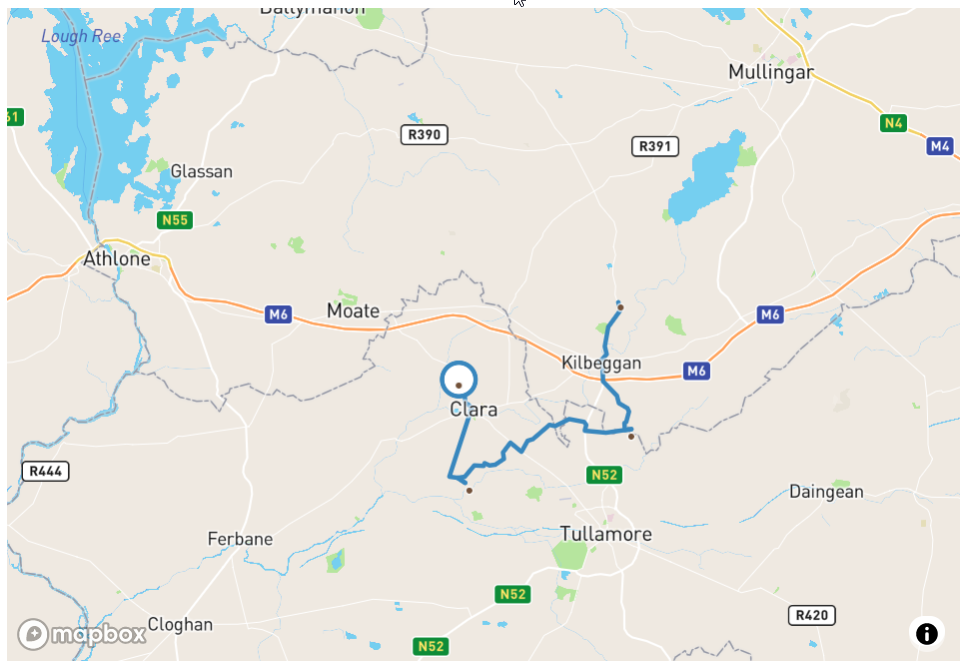

#### __Map Control Buttons__
The map controls allows the user more control over setting their route on the map. The first being a checkbox that allows the user to set the next waypoint at the same location as the starting point (it's possible to have multiple loops in the same route as long as the number of waypoints is 24 or below). Next the Undo button allows the user to remove the last waypoint in the route. Finally the Reset Route button allows the user to completely remove everything relating to the current route build from the map and start over.

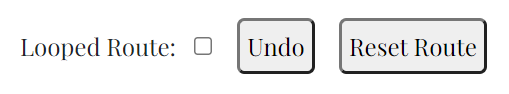

#### __Map Output__
The map output shows the the distance of the current route and the number of waypoints left to use (note: the looped waypoint counts as a waypoint). Both update upon each click of map, undo, or reset.

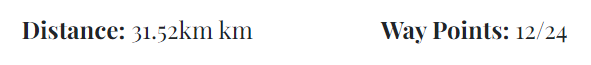

#### __Weather Day & Time Input__
These inputs allow the user to pick the day and time of their run to request the relevant weather information.

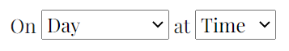

#### __Get Weather Button__
This button allows the user to then send the request for the weather information for said day and time.

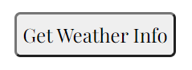

#### __Weather Information Display__
The weather output then provides the description of the weather in the form of an image (hovering over the image will give the description in text), the median, max and min temperature, the chance of rain, the wind speed, and the wind direction.

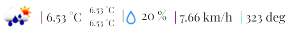

#### __Link to My Github__
This text provides a link to the Github account of the creator of the site.


### Alert Features for

#### __No Current Location__
An alert telling the user that their current location could not be found when trying to use it for the staring point with the 'Start where I am' button.

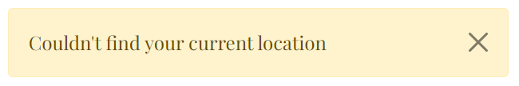

#### __No Route Info__
A warning telling the user that the request for the route information isn't working and to contact the creator of the site.

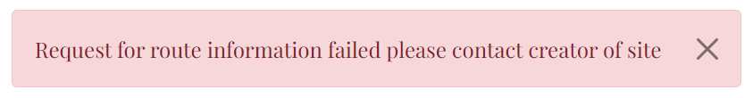

#### __Waypoint Limit Reached__
An alert that tels the user that they have reached the limit of waypoints used on the map.

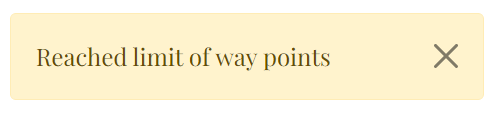

#### __Choose Time to get Weather__
An alert that asks the user to choose a time in the future when trying to request weather information. This is either the user has chosen a time in the past on the current day or they have not chosen any time or day.

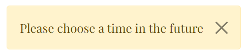

#### __No Starting Point Selected__
An alert that reminds the user to set a starting point where they want the weather information for.

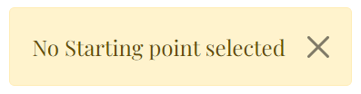

#### __No Weather Information Returned__
An alert that informs the user that the request for the weather information has failed.

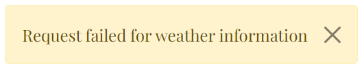


[Back to content](#contents)

---

## Changes applied since planning

All changes refer to what is different from the [Wireframes](docs/wireframes) and the [Deployed Site](https://sean-meade.github.io/plan-my-run/)

The blue band across the top of the wire frame with the title 'PLAN MY RUN' was removed because it did not fit in with the open flow of the website. The title text was instead moved the hero image and that was made the header section.

The search button for location was made redundant because clicking on the options in the drop-down list provides the same function.

The first 'Use Current Location' was removed as the same function can be achieved with the second 'Use Current Location' button (now named 'Start where I am') and the undo button. Because of this the 'Start where I am' button has been removed from further down and placed here instead.

The Plan Your Route section has been moved above the weather information due to the Information Architecture. The map has been placed at the top of this section as it is the natural next step after choosing starting location.

The 'Undo' button has been placed beside the 'Looped Route' (now a checkbox for a cleaner look) due to the limitations of the developer. A 'Reset Route' button has been added as user feedback dictated it a very useful feature.

Weather information has two changes. It is now below the Plan Your Route section and the button is now a simple 'Get Weather Info'.

Text has also been provided to inform the user along with alerts for errors.

---

## Testing

### User Stories Testing
- As a user, I am able to quickly understand how to navigate the site.
	- The website flows from top to bottom with the steps clearly layed out.
	- The buttons on the site inform the user of their purpose in a clear way.

- As a user, I am able to choose what location to start the run in.
	- The user is presented with way of choosing the area and clicking of the map or using the 'Start where I am' button.

- As a user, I am able to change the location when I want.
	- Using the find location search field will take the user to the area they want.
	- The user can click and drag the map to the location of their choice.

- As a user, I am able to choose the day and time for a run and with location receive weather information
	- With a starting point selected, and a day and time (in the future) chosen and by clicking the 'Get Weather Info' button can get the relevant weather information.

- As a user, I am able to change the day and time and update the weather information.
	- At any time time the user can select a new day and time (again in the future) and by clicking the 'Get Weather Info' button can get the relevant weather information.

- As a user, I am able to use the mouse to map out a running route and receive the distance of the route in return.
	- The user can click on the map to create waypoints to map out a route. The distance is then updated automatically.

- As a user, I am able to undo points of my route and the distance and map updates accordingly.
	- The 'Reset Route' and 'Undo' buttons allow the user to clear the route completely or undo their last choice of way point. When used the distance automatically updates.

- As a user, I am able to make my run a looped run (returns back to where I started) and the distance and map updates accordingly.
	- By clicking the looped route checkbox (when enabled) it will bring the route back to the starting point. The distance and waypoints update automatically.

- As a user, I am able to reset the map at any point and start fresh.
	- The 'Reset Route' button allows the user to clear the route completely and the distance and number of waypoints goes to zero. The user can then start making a route from the beginning again.

- As a user, I am able to find information or a link to the creator of the site.
	- All information is plain to see including any alerts activated by the user. A link to the creators Github is in the Footer.

### Manual Testing 
* Browser Compatibility

Browser | Outcome | Pass/Fail  
---|---|---
Google Chrome | No appearance, responsiveness nor functionality issues.| Pass
Safari | No appearance, responsiveness nor functionality issues. | Pass
Mozilla Firefox | No responsiveness nor functionality issues.| Pass
Microsoft Edge | No appearance, responsiveness nor functionality issues. | Pass

* Device compatibility (responsiveness)

Device | Outcome | Pass/Fail
--- | --- | ---
Mobile | No appearance, responsiveness nor functionality issues. | Pass
Laptop| No appearance, responsiveness nor functionality issues. | Pass
Mac | No appearance, responsiveness nor functionality issues. | Pass
iPad | No appearance, responsiveness nor functionality issues. | Pass
iPhone XR | No appearance, responsiveness nor functionality issues. | Pass
iPhone SE| No appearance, responsiveness nor functionality issues. | Pass


### Code Validation

- [W3C CSS Validator](https://jigsaw.w3.org/css-validator) found no errors or warnings in my CSS.

- [Html Validator](https://validator.w3.org/nu/) found no errors or warnings in my HTML.

- [JSHint](https://jshint.com/) found the undefined variables (which are defined from outside that particular js either imported with a script or in another js file I have written)

Code | Page | Score  
--- | --- | --- 
CSS | Site Wide | 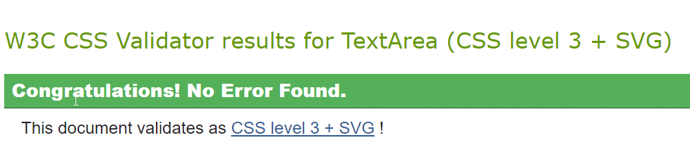
HTML | Home Page | 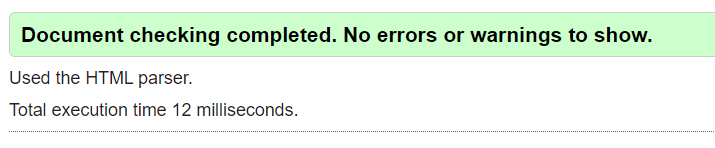
JavaScript| route.js | 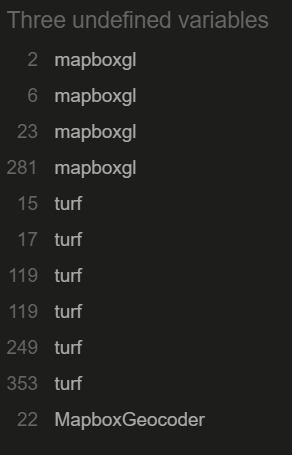
JavaScript| live-alert.js | 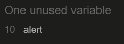
JavaScript| loading-screen.js | No errors or warnings
JavaScript| weather-input.js | No errors or warnings
JavaScript| weather.js | 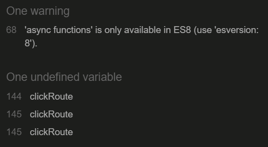

### Lighthouse Reports
Report | Score | Summary  
--- | --- | ---
Mobile | 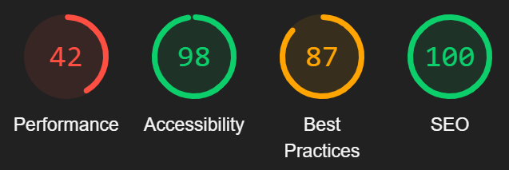 | - Used [Lighthouse](https://web.dev/measure/) to confirm that the colors and fonts being used in throughout the website are easy to read and accessible. <br> - Was also used to test that the page loads correctly without delay to ensure a positive user experience.
Desktop | 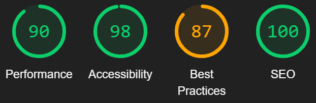 | - Used [Lighthouse](https://web.dev/measure/) to confirm that the colors and fonts being used in throughout the website are easy to read and accessible. <br> - Was also used to test that the page loads correctly without delay to ensure a positive user experience.

<br>

### Common Elements Testing 
- General

Feature | Outcome | Pass/Fail
--- | --- | ---
Heading | CSS styles work as expected on each page | Pass
Buttons | Operate as expected | Pass

- Home Page

Feature | Outcome | Pass/Fail
--- | --- | ---
Search Location Field | Searches locations and sets center of map | Pass
Start Where I am Button | Sets current location as starting point | Pass
Map click | Sets starting point on first click and then way points and route | Pass
Looped Route Checkbox | completes a route back to the starting point | Pass
Undo Button | Removes a waypoint and that section of route. Updates waypoints left and distance | Pass
Reset Route Button | Removes everything from the map and allows user start again | Pass
Route distance output | returns distance of current route | Pass
Waypoints left output | returns waypoints left to use of current route | Pass
Weather input day and time | takes in a day and time from user | Pass
Get Weather Info | Shows user relevant weather data for given location, day and time | Pass


## Bugs: 
### Fixed Bugs:
Bug | Image | Notes 
--- | --- | ---
When time chosen for weather information was in the past an error of undefined would appear | 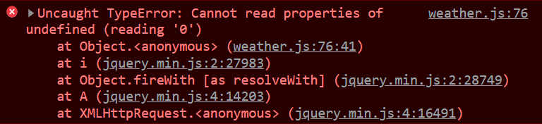 | - The request for the weather information was returning as a 404 and did't contain weather information <br> - Created a check for the input tim and day and call the alert before the request is even made
When more then 24 waypoints (clicks) are used to make a route the following error appears in the console | 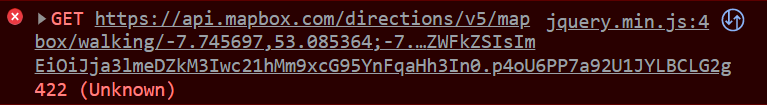 | - The request to Mapbox directions API can only take 24 pairs of latitude and longitude when requesting a route. <br> - Limited the number of waypoints and return an alert if the limit is reached.
When Undo button used on looped route with only 2 waypoints the looped route stays checked but it turns disabled. | 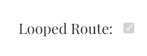 | - There are different functions called when resetting, undoing, or changing location. All of which you could have the button stay checked but turn disabled. <br> - Added `document.getElementById('looped-route').checked = false;` to all of them

 


### Unfixed Bugs: 
Bug | Image | Notes 
--- | --- | --- 
Two of the same errors show blocking of a Mapbox request | 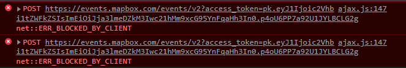 | - The ad blocker picks up on the word 'event' in the url and tries to block it<br> - This does not effect the functionality of the web app however you can turn off your add blocker and the errors go away
On reload the following warning about permission-policy appears | 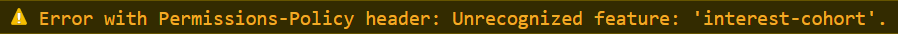 | - Github have changed their policy and GitHub hosted pages disable FLoC which has to deal with cookies <br> - Ignore as functionality is not effected and would need to find alternative hosting method to remove


## Future Features:
- Some Features I would like to add in the future include: 
    - I'd love to get a more comprehensive weather API and do more then 4 days of weather.
    - A buffer for when the weather information is loading.
    - Improve performance on mobile maybe by using local versions of the imported js and striping it back to what I need.

[Back to content](#contents)

---

## Deployment

The site was deployed to GitHub pages. The steps to deploy are as follows:
1.	In the repository navigate to the settings tab.
2.	Select Pages from the navigation on the left hand side.
3.	Select main (sometimes called master) branch, the root (meaning the root directory of your repo) and then save.
You will then be presented with a link to your hosted repository located right above the Source settings you just saved.

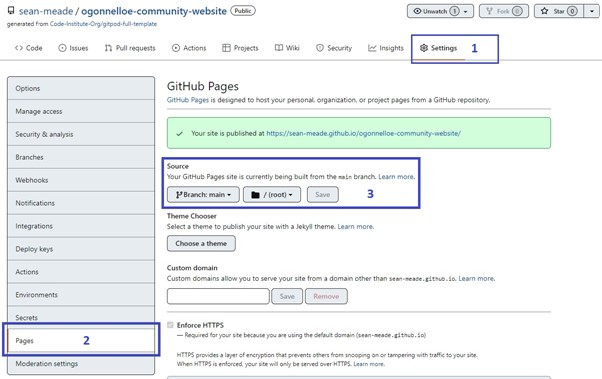

### Forking the GitHub Repository

By forking the GitHub Repository we make a copy of the original repository on our GitHub account to view and/or make changes without affecting the original repository by using the following steps...

1. Log in to GitHub and locate the [GitHub Repository](https://github.com/)
2. At the top of the Repository (not top of page) just above the "Settings" Button on the menu, locate the "Fork" Button.
3. You should now have a copy of the original repository in your GitHub account.

### Making a Local Clone

1. Log in to GitHub and locate the [GitHub Repository](https://github.com/)
2. Under the repository name, click "Clone or download".
3. To clone the repository using HTTPS, under "Clone with HTTPS", copy the link.
4. Open Git Bash
5. Change the current working directory to the location where you want the cloned directory to be made.
6. Type `git clone`, and then paste the URL you copied in Step 3.

```
$ git clone https://github.com/sean-meade/plan-my-run.git
```

7. Press Enter. Your local clone will be created.

```
$ git clone https://github.com/sean-meade/plan-my-run.git
> Cloning into `CI-Clone`...
> remote: Counting objects: 10, done.
> remote: Compressing objects: 100% (8/8), done.
> remove: Total 10 (delta 1), reused 10 (delta 1)
> Unpacking objects: 100% (10/10), done.
```

Click [Here](https://help.github.com/en/github/creating-cloning-and-archiving-repositories/cloning-a-repository#cloning-a-repository-to-github-desktop) to retrieve pictures for some of the buttons and more detailed explanations of the above process. 

[Back to content](#contents)

---

## Credits

### Images

* The hero image was gotten from [Pixabay](https://pixabay.com/photos/road-highway-journey-asphalt-5089188/)
* Rain drop icon from weather is from [Iconfinder](https://www.iconfinder.com/)

### Image editing

* Image editing was done with [LunaPic](https://www4.lunapic.com/editor/)
* Darkened the hero image with [Pinetools](https://pinetools.com/darken-image)
* Converted all images to webp with [Convertio](https://convertio.co/)

### Code ideas

* Loading screen adapted from Section 6 of the [50 Projects In 50 Days](https://www.udemy.com/course/50-projects-50-days/) course on Udemy.com by Brad Traversy 
* Alerts were created using [Bootstrap Alerts](https://getbootstrap.com/docs/5.1/components/alerts/)
* The [Generate an optimized route](https://docs.mapbox.com/help/tutorials/optimization-api/) and [Add a geocoder](https://docs.mapbox.com/mapbox-gl-js/example/mapbox-gl-geocoder/) examples on Mapbox along with the [documentation](https://docs.mapbox.com/) (as well as a **lot** of trial and error) were used to create the route and it's functionality.
* From Stackoverflow I adapted this [answer](https://stackoverflow.com/questions/8674618/adding-options-to-select-with-javascript/8674667) by David Thomas and [this answer](https://stackoverflow.com/questions/563406/add-days-to-javascript-date) by AnthonyWJones to create the weather options.

[Back to content](#contents)

---

## Acknowledgements

My Code Institute Mentor

Site creator:

[Sean Meade](https://github.com/sean-meade)

[Back to content](#contents)

